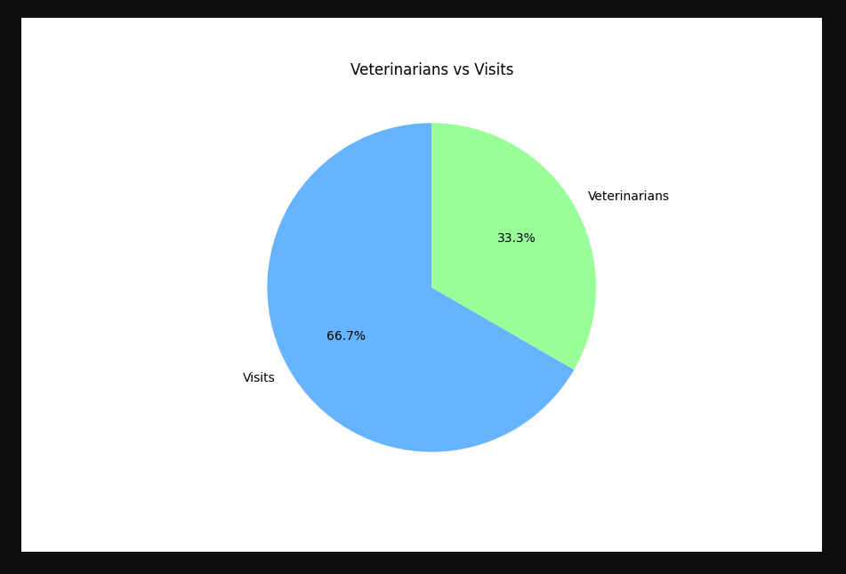

# Microservices Demo with Docker Compose

This repository demonstrates a microservices architecture using Docker Compose. The system consists of three microservices:

1. **Spring Boot Service(`springboot-service`)**
2. **Stats Service(`stats-service`)**
3. **Logs Service(`logs-service`)**

The services interact with a MySQL database to provide functionality for capturing and managing data related to animal visits and veterinarians.

---

## Prerequisites

Before running the application, ensure the following are installed:

- [Docker](https://www.docker.com/)
- [Docker Compose](https://docs.docker.com/compose/)

---

## Getting Started

Follow these steps to run the microservices:

1. **Clone the Repository:**
   ```bash
   git clone https://github.com/Agusioma/circleci-microservices-unit-testing-demo.git
   cd circleci-microservices-unit-testing-demo
   ```

2. **Start the Docker Containers:**
   Run the following command to start all services:
   ```bash
   docker-compose up --build
   ```

   This command will build the images for each service and start the containers. The services will be accessible after the containers are fully initialized.

---

## Accessing the Services

### Spring Boot Service
- **Endpoint:** [http://localhost:8080](http://localhost:8080)
- Use this service to add and manage visits and veterinarians.
  - Add a new visit: [http://localhost:8080/visits/new](http://localhost:8080/visits/new)


  - Add a new veterinarian: [http://localhost:8080/veterinarians/new](http://localhost:8080/veterinarians/new)

  

### Stats Service
- **Endpoint:** [http://localhost:8000/chart](http://localhost:8000/chart)
- This service provides aggregated statistics based on the data collected using a pie chart.



### Logs Service
- **Internal Usage Only:** The logs service is called internally by the Spring Boot Service to log data.
- **Endpoint:** `logs-service:5001/api/logs`
- It records logs whenever a new veterinarian or animal visit is added.

---

## Stopping the Application

To stop all services, run:
```bash
docker-compose down
```

This command stops and removes the containers but preserves the database data stored in the Docker volume.

---

## Additional Notes

- Ensure the Docker daemon is running before executing the commands.
- Logs can be viewed for debugging by using:
  ```bash
  docker-compose logs
  ```
- If you encounter connection issues, verify the services are healthy by running:
  ```bash
  docker ps
  ```

---

If you have any questions, feel free to open an issue in this repository.

